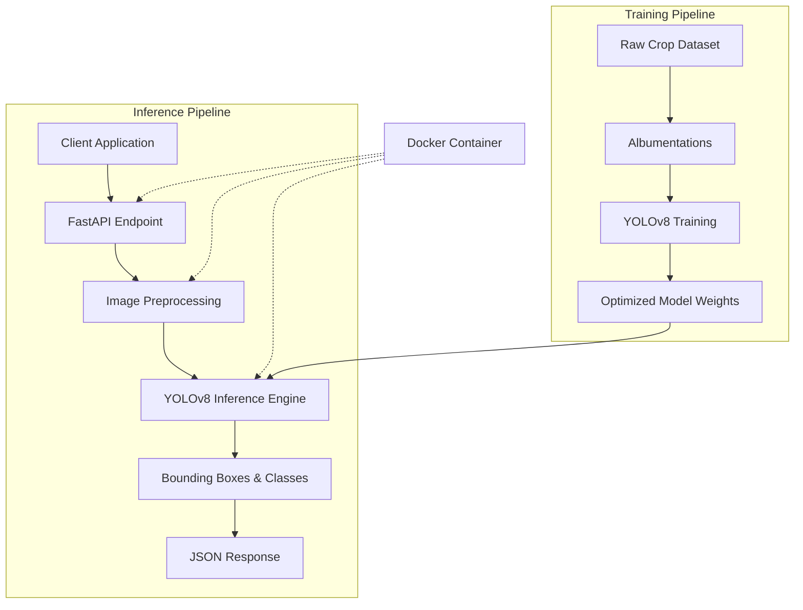
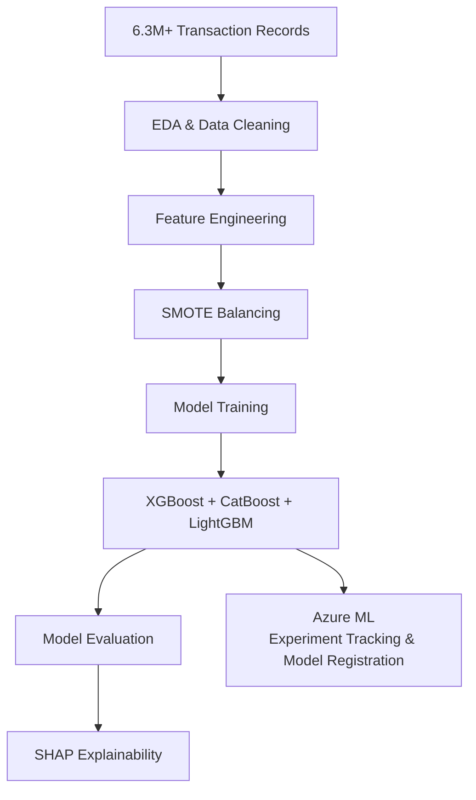
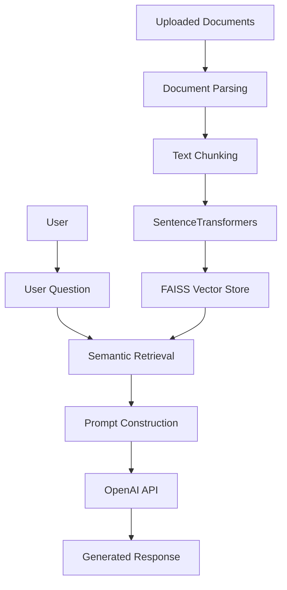
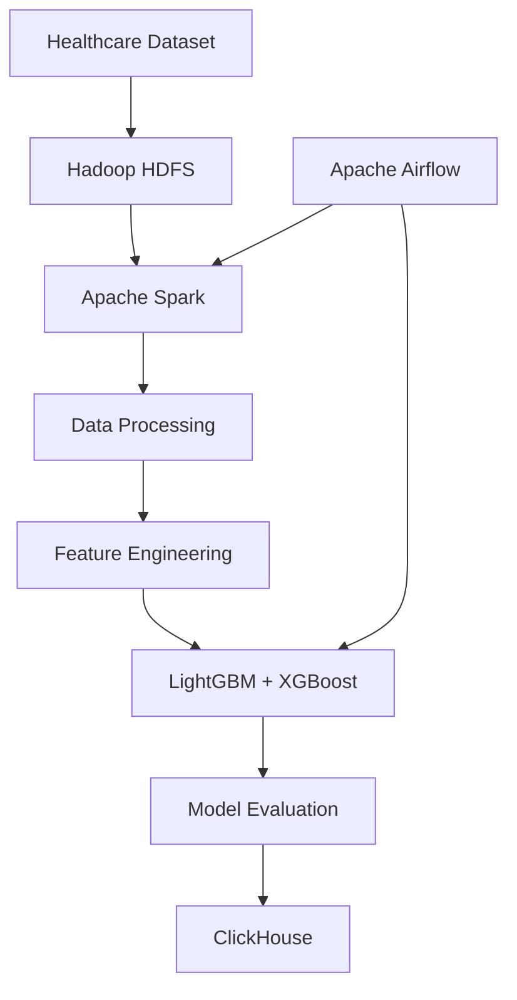

<!-- HEADER SECTION -->
<table width="100%" cellpadding="0" cellspacing="0" border="0">
  <tr>
    <td width="75%" valign="top">
      <h1>⚡ Abdulrahman Ahmed</h1>
      <h3>Data Scientist | AI Systems Engineer | Data Analyst</h3>
      
<i>Focused on building reliable machine learning pipelines, distributed big data workflows, and optimized computer vision inference configurations. Experienced in translating statistical data analysis into structured, reproducible codebases.</i>

      
📍 Benha, Egypt | 💻 Available for Remote & Global Opportunities

    </td>

    <td width="25%" align="right" valign="top">
      

        

      
    </td>
  </tr>
</table>

---

## 📊 Technical Performance & Impact Dashboard

*Key model evaluation metrics, benchmark results, and processing scales derived from the implemented projects.*

<table width="100%">
<tr>

<td width="20%" align="center" bgcolor="#0d1117">
 
<b>99.2%</b>

<b>AUC-ROC Score</b> 
<small>Fraud Ensemble Model</small>

</td>

<td width="20%" align="center" bgcolor="#0d1117">
 
<b>95.0%</b>

<b>mAP Score</b> 
<small>YOLOv8 Vision Model</small>

</td>

<td width="20%" align="center" bgcolor="#0d1117">
 
<b>&lt;50ms</b>

<b>Inference Latency</b> 
<small>Edge Simulation Target</small>

</td>

<td width="20%" align="center" bgcolor="#0d1117">
 
<b>6.3M+</b>

<b>Records Processed</b> 
<small>Financial Analytics Data</small>

</td>

<td width="20%" align="center" bgcolor="#0d1117">
 
<b>100+</b>

<b>Students Trained</b> 
<small>Technical Mentorship</small>

</td>

</tr>
</table>

---

# 🛠️ Expertise & Technical Proficiencies

## 👁️ Deep Learning & Computer Vision

- **Core Paradigms:** Real-Time Object Detection, Multi-Class Image Classification, Target Segmentation, Transfer Learning, Inference Optimization, Frame Processing.
- **Libraries & Ecosystem:** PyTorch, TensorFlow, Keras, YOLOv8, OpenCV, Torchvision, Albumentations.

---

## 💬 Natural Language Processing & Document Systems

- **Core Paradigms:** Retrieval-Augmented Generation (RAG), Semantic Search Systems, Document Chunking Strategies, Dense Vector Representation, Tokenization.
- **Libraries & Ecosystem:** BERT, SentenceTransformers, FAISS (Vector Indexing), OpenAI API.

---

## 📉 Data Science & Advanced Analytics

- **Core Paradigms:** Predictive Modeling, Exploratory Data Analysis (EDA), Statistical Inference, Feature Engineering, Imbalance Correction (SMOTE), Feature Importance Mapping (SHAP).
- **Libraries & Ecosystem:** Pandas, NumPy, Scikit-learn, SciPy, Matplotlib, Seaborn.

---

## 🧠 Machine Learning & Tree Ensembles

- **Core Paradigms:** Supervised & Unsupervised Learning, Gradient Boosting Frameworks, Hyperparameter Optimization, Validation Strategy Design.
- **Libraries & Ecosystem:** XGBoost, CatBoost, LightGBM.

---

## ⚙️ Distributed Systems & Operations

- **Data Infrastructure:** Apache Spark 3.5, Hadoop HDFS, PostgreSQL, MySQL, ClickHouse.
- **Execution & Lifecycle:** Apache Airflow, Docker, FastAPI, Flask, Streamlit, Google Colab, MLflow, Azure ML (Experiment Tracking & Model Registration), GitHub Actions.

---

# 🏆 Featured Portfolio Projects
   ### 🌾 Napta — Smart Agricultural AI Ecosystem

#### Problem
Developing a localized computer vision system for multi-class crop disease detection capable of running within resource-limited edge inference cycles under varying network bandwidth constraints.

#### Architecture
The system exposes a fine-tuned YOLOv8 inference engine through a lightweight FastAPI service packaged inside a Docker container, enabling low-latency edge inference and platform-independent deployment.

#### Architecture Diagram

#### My Role

**AI Engineer** (Team Size: 6)

#### Technical Ownership

Led the design, implementation, and optimization of the AI module.

#### My Contributions

- Designed and implemented the complete AI pipeline for crop disease detection.
- Built image preprocessing and augmentation workflows using Albumentations.
- Trained and fine-tuned custom YOLOv8 models to classify 12 crop disease categories.
- Optimized inference performance for edge-device execution.
- Integrated the trained model into a FastAPI inference service.
- Containerized the inference pipeline using Docker.
- Collaborated with the team to integrate the AI module into the complete graduation project.

#### Tech Stack

PyTorch • YOLOv8 • OpenCV • Albumentations • FastAPI • Docker • GitHub Actions

#### Results

- Achieved **95.0% mAP** on the evaluation dataset.
- Reached **sub-50ms inference latency** during edge simulation.
- Graduation Project Grade: **Excellent (A+)**

---

### 💳 High-Precision Financial Fraud Detection Suite

#### Problem

Building a fraud detection system capable of identifying fraudulent transactions from highly imbalanced financial datasets while minimizing false-positive predictions.

#### Architecture

A modular machine learning pipeline consisting of data preprocessing, class balancing, feature engineering, ensemble model training, explainability, and experiment tracking.

#### Architecture Diagram

#### My Role

**Solo Project**

#### Technical Ownership

End-to-end pipeline implementation, model development, evaluation, and framework integration.

#### My Contributions

- Performed exploratory data analysis on a dataset containing more than **6.3 million** transaction records.
- Built preprocessing and feature engineering pipelines.
- Addressed severe class imbalance using **SMOTE**.
- Trained and compared **XGBoost**, **CatBoost**, and **LightGBM** models.
- Selected the best-performing ensemble through cross-validation.
- Used **SHAP** to explain prediction behavior and feature importance.
- Managed experiment tracking and model registration using **Azure ML (Experiment Tracking & Model Registration)**.

#### Tech Stack

Python • Pandas • NumPy • Scikit-learn • XGBoost • CatBoost • LightGBM • SHAP • SMOTE • Azure ML

#### Results

- Achieved **99.2% AUC-ROC** on the evaluation dataset.
- Successfully handled highly imbalanced transaction data while maintaining strong classification performance.
---

### 🏢 Enterprise Document Intelligence Pipeline

#### Problem

Building a document-based Retrieval-Augmented Generation (RAG) system capable of answering user questions from uploaded documents while maintaining deterministic retrieval and minimizing hallucinations.

#### Architecture

A deterministic Retrieval-Augmented Generation (RAG) pipeline that processes uploaded documents through parsing, chunking, embedding generation, vector indexing, semantic retrieval, prompt construction, and LLM inference.

#### Architecture Diagram

#### My Role

**Solo Project**

#### Technical Ownership

Designed and implemented the complete Retrieval-Augmented Generation pipeline, including document processing, vector indexing, semantic retrieval, prompt construction, and application deployment.

#### My Contributions

- Built document ingestion pipelines supporting multiple document formats.
- Implemented document parsing and preprocessing workflows.
- Designed custom chunking strategies to preserve contextual continuity.
- Generated semantic embeddings using SentenceTransformers.
- Indexed document vectors using FAISS.
- Developed deterministic semantic retrieval workflows.
- Constructed prompts dynamically using retrieved document context.
- Integrated OpenAI API for response generation.
- Built an interactive Streamlit interface.
- Containerized the application using Docker.

#### Tech Stack

Python • SentenceTransformers • FAISS • OpenAI API • Streamlit • Docker

#### Results

- Successfully developed a lightweight document question-answering system.
- Delivered reproducible retrieval results using deterministic semantic search.
- Packaged the entire application inside Docker for reproducible deployment.

---

### 🏥 Scalable Healthcare Recommendation Engine

#### Problem

Developing a scalable recommendation system capable of processing large healthcare datasets and generating personalized medical recommendations using distributed data processing and machine learning.

#### Architecture

A distributed big data pipeline combining Apache Spark processing, Hadoop storage, machine learning recommendation models, workflow orchestration, and analytical storage.

#### Architecture Diagram

#### My Role

**Data Science & Big Data Engineer** (Team Size: 4)

#### Technical Ownership

Responsible for the distributed data processing layer, recommendation modeling, workflow orchestration, and evaluation components.

#### My Contributions

- Developed distributed data processing pipelines using Apache Spark.
- Managed healthcare datasets stored on Hadoop HDFS.
- Implemented feature engineering workflows.
- Built recommendation models using LightGBM and XGBoost.
- Evaluated recommendation model performance.
- Automated workflows using Apache Airflow DAGs.
- Stored processed analytical results inside ClickHouse.
- Collaborated with the team to integrate the recommendation engine into the complete healthcare platform.

#### Tech Stack

Apache Spark 3.5 • Hadoop HDFS • LightGBM • XGBoost • Apache Airflow • ClickHouse

#### Results

- Built scalable distributed processing pipelines for healthcare analytics.
- Processed more than **500K+** healthcare records.
- Automated data workflows using Apache Airflow.
- Generated reproducible recommendation pipelines for multiple healthcare specialties.

  ---

# 💼 Professional Experience

### **Data Science Lead Trainer** | AXIS Tech Community
*May 2025 – Present*

- Delivered structured Data Science and Machine Learning training programs for **100+ students**.
- Taught Python programming, SQL, data preprocessing, Exploratory Data Analysis (EDA), supervised learning, model evaluation, and ensemble methods.
- Designed hands-on projects covering regression, classification, recommendation systems, and computer vision.
- Mentored students through project implementation and technical problem-solving.

---

### **Data Science Intern** | Pure Soft
*Dec 2025 – Feb 2026*

- Built end-to-end data preprocessing and feature engineering pipelines on datasets containing over **100K+ records**.
- Developed and evaluated machine learning models using Scikit-learn and XGBoost.
- Created RESTful APIs using FastAPI.
- Containerized inference services using Docker for reproducible deployment.
- Collaborated with team members following Git-based development workflows.

---

### **AI Intern** | Aitronix
*Sep 2025 – Nov 2025*

- Managed experiment tracking and model registration using **Azure ML (Experiment Tracking & Model Registration)**.
- Maintained model artifacts and datasets using Azure Blob Storage.
- Supported model development and evaluation workflows.
- Improved reproducibility across machine learning experiments.

---

# 🎓 Education & Certifications

## 🏛️ Education

**Bachelor of Computer Science & Artificial Intelligence**  
**Benha University** *(Graduation: July 2025)*

- **Overall Grade:** Good
- **Graduation Project:** Napta – Smart Agricultural AI Ecosystem
- **Graduation Project Grade:** Excellent (A+)

---

## 📜 Technical Training & Certifications

- Data Science & Advanced Analytics
- Machine Learning Engineering
- Deep Learning & Computer Vision
- Big Data Engineering
- Natural Language Processing (NLP)
- Generative AI & Retrieval-Augmented Generation (RAG)

---

# 📊 GitHub Analytics

  

  

---

  <b>Thanks for visiting my profile!</b> 
  I'm always interested in collaborating on AI, Data Science, Machine Learning, Computer Vision, NLP, and Big Data projects.

